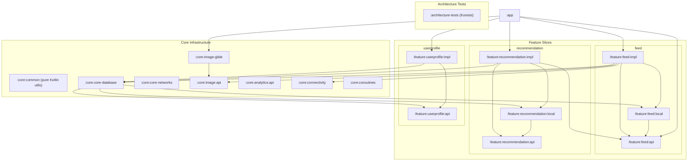
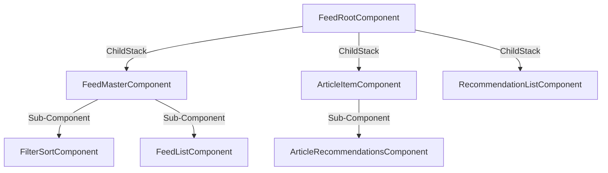

# Project Architecture Overview

This document provides a comprehensive overview of the **Smart Feed** application architecture. The project is designed as a senior-level showcase of scalable, testable, and modular Android development using **Feature-Driven Vertical Slice Architecture**, **Decompose** navigation, and **Kotlin-first** patterns.

---

## 1. Core Architectural Philosophy

The architecture has evolved from a **Horizontal Monolith** (shared global `core-domain` and `core-data` layers) to a **Vertical Feature Slice** model. Each feature now owns its entire stack — from domain contracts down to local database storage, while `:core:common` remains a small pure-Kotlin utility module for reusable helpers.

This transition was driven by:
- **Build performance**: Smaller, focused modules maximize Gradle's build cache and parallel compilation.
- **Team scalability**: Feature boundaries prevent cross-team accidental coupling.
- **Testability**: Isolated domain modules require no Android framework — pure JVM unit tests.
- **KMP readiness**: Pure Kotlin `:api` modules are portable to Kotlin Multiplatform without modification.

---

## 2. Module Dependency Diagram



> **Note on Room & Circular Dependency Prevention**: Room requires the `@Database` class to enumerate all `@Entity` types at compile time. If entities lived in `:feature:<name>:impl`, then `:core:core-database` would depend on `:feature:<name>:impl`, and `:feature:<name>:impl` on `:core:core-database` — creating a circular Gradle dependency. The `:feature:<name>:local` module breaks this loop: it has no dependency on `:core:core-database`, yet `:core:core-database` can safely depend on it to discover entities.

---

## 3. Feature 3-Module Structure

Every feature follows a strict 3-module pattern:

| Module | Contents | Dependencies |
|--------|----------|--------------|
| `:feature:<name>:api` | Domain models, repository interfaces, component contracts (Decompose), state objects | Pure Kotlin only — no Android, no Hilt |
| `:feature:<name>:local` | Room `@Entity` classes, `@Dao` interfaces, TypeConverters for this feature | `:feature:<name>:api` only |
| `:feature:<name>:impl` | UI layouts (XML/Compose), component implementations, repository implementations, Hilt modules, feature-owned Paging adapters | `:api`, `:local`, `:core:core-database`, `:core:image:api`, etc. |

---

## 4. Core Infrastructure Modules

`core` modules provide only **cross-cutting infrastructure**. They contain no business logic:

| Module | Responsibility |
|--------|----------------|
| `:core:common` | Pure Kotlin shared utilities: coroutine extensions, embedding math, time converters. _(Renamed from `:core:core` — Android manifest removed, pure JVM module)_ |
| `:core:core-database` | `RoomDatabase` orchestrator, cross-feature schema migrations |
| `:core:core-networks` | Retrofit/Ktor client configuration, dev/prod network data sources |
| `:core:image:api` | Pure Kotlin `ImageLoader` interface (KMP-portable, no Glide dependency) |
| `:core:image-glide` | Glide implementation of `ImageLoader` |
| `:core:analytics:api` | `AnalyticsService` interface |
| `:core:analytics:impl` | Analytics implementation |
| `:core:connectivity` | `ConnectivityRepository` — network state monitoring (modern observer-based implementation) |
| `:core:lifecycle` | `AppLifecycleObserver` |
| `:core:coroutines` | Coroutine `Dispatchers` DI module, Flow extension utilities |

> **Note on Paging**: `AndroidX Paging` (`PagingData`, `GetPagedContentUseCase`, `ContentPagingRepository`) was initially extracted into `:core:core-paging` to decouple it from domain. It has since been **moved into `:feature:feed:impl`** — the only consumer — eliminating an unnecessary intermediate module and keeping Paging concerns co-located with the feature that owns them.

---

## 5. Decompose Component Tree

The presentation layer is governed by a component tree managed by **Decompose**. Instead of relying on traditional Android Fragments/Activities, Decompose splits UI and business logic into lifecycle-aware **Components**:



### Component Responsibilities
* **`FeedRootComponent`**: Manages the `ChildStack` navigation between Feed, Details, and Recommendations. Handles shared-element transition registration via `TransitionRegistry`.
* **`FeedMasterComponent`**: Orchestrates filter/sort state and coordinates feed list loading.
* **`FeedListComponent`**: Encapsulates Paging 3 data loading, loading/error/empty state tracking, and swipe-to-refresh.
* **`ArticleItemComponent`**: Renders Markdown content (Markwon), tracks read-percentage analytics, and loads contextual article recommendations.
* **`RecommendationListComponent`**: Displays recommendations ranked by cosine similarity of content embeddings.

---

## 6. Dependency Injection (DI)

We use **Dagger Hilt** throughout.

- Component factories use `@AssistedInject` to allow Decompose to pass `ComponentContext` and runtime parameters (e.g. `itemId` for the Details screen) dynamically.
- Each feature's `:impl` module declares its own Hilt `@Module` with `@Binds` binding the implementation to the API interface.
- The `:app` module only references public API contracts from feature modules. It never imports `*Impl` classes directly.

---

## 7. Executable Architecture Enforcement (Konsist)

A dedicated JVM module `:architecture-tests` runs on every CI build via `./gradlew :architecture-tests:test`.

Enforced rules:
- `:feature:<name>:api` modules must not import Android platform APIs, Room, Retrofit, Hilt, or Decompose.
- `:feature:<name>:impl` must not expose its implementation factories via the API contract.
- Decompose component implementations must follow the naming suffix convention (`ComponentImpl`).
- MVI Reducers must be pure functions — no side effects.

---

## 8. Static Quality Gate Pipeline

Every commit is validated through a tiered gate:

```bash
# 1. Code formatting (Spotless + Ktlint)
./gradlew spotlessCheck

# 2. Static analysis (Detekt 2 — layered profiles per module type)
./gradlew detekt

# 3. Architecture consistency tests (Konsist)
./gradlew :architecture-tests:test

# 4. Unit tests
./gradlew test
```

Detekt **2.0** profiles are layered per module type:
- `detekt-common.yml` — base rules shared across all modules.
- `detekt-domain.yml` — strictest. No complexity violations in business rules.
- `detekt-data.yml` — moderate. Allows slightly larger classes for repository implementations.
- `detekt-ui.yml` — relaxed on complexity (UI state machines are inherently complex).
- `detekt-test.yml` — permissive. Readability over brevity in tests.
- `detekt-android-test.yml` — rules for instrumented Android tests.

---

## 9. Build Noise Reduction

The following recurring Gradle/toolchain warnings were resolved as part of Phase 7:

- **Dokka Gradle plugin V2** migration helpers — disabled via `gradle.properties`.
- **AGP deprecated APIs** (`applicationVariants`, `libraryVariants`) — migrated to `AndroidComponentsExtension`.
- **Detekt migration to 2.x** — updated plugin coordinates (`io.gitlab.arturbosch.detekt` → `dev.detekt`), removed deprecated rule keys, updated config files.
- **KSP / Kotlin version alignment** — upgraded to Kotlin **2.3.21** and KSP **2.3.9** to eliminate version mismatch warnings.
- **ConnectivityRepository** — replaced legacy `NetworkCallback` approach with modern `NetworkObserver`-based implementation.
- **`gradle.properties` cleanup** — removed obsolete feature flags that triggered deprecation warnings.
