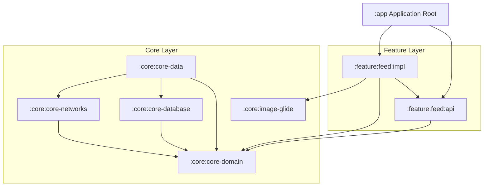
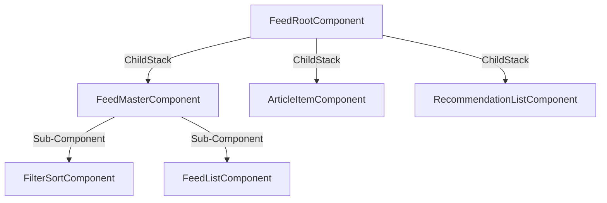

# Project Architecture Overview

This document provides a comprehensive overview of the architecture of the **Smart Feed** application. The project is designed as a showcase of scalable, highly testable, and modular Android development practices using **Decompose** and **Kotlin Multiplatform-inspired** structuring.

---

## Architecture Diagram

Below is the conceptual architecture of the application, showing the separation of layers and dependency directions:

---

## 1. Modularization Strategy

To support clean separation of concerns and scalable build performance, the project uses a layered, multi-module configuration:

1. **Application Module (`:app`)**:
   - Serves as the composition root. It installs the Hilt Application classes, registers App Initializers, and initializes the root Decompose view controller (`MainActivity`).
   - Only references public component contracts from the feature API modules for compile-time safety, injecting concrete implementations via Hilt binds.

2. **Feature Layer (`:feature:xxx`)**:
   - Separated into **API** (`:feature:xxx:api`) and **Implementation** (`:feature:xxx:impl`) submodules.
   - **API Module**: Contains Decompose components (interfaces), configuration parameters, route configurations, and state definitions. This module has no dependencies on UI libraries or Hilt, enabling rapid unit testing and preventing circular dependencies.
   - **Implementation Module**: Houses the UI layouts, XML view-bindings, Jetpack Compose layouts, assisted-inject component factories, and internal state engines (MVI Kotlin/Reducers).

3. **Core Layer (`:core:xxx`)**:
   - **`:core:core-domain`**: Pure Kotlin domain models, repository interfaces, and use cases. No Android-specific dependencies.
   - **`:core:core-data`**: Implementations of repositories, fetching policies, and local/network sync logic.
   - **`:core:core-database`**: Room Database declaration, entities, and converters.
   - **`:core:core-networks`**: Network client configurations, API endpoints, and mock servers.
   - **`:core:image-glide`**: Glide wrapper configuration for loading images in RecyclerView and custom views.

---

## 2. Decompose Component Tree

The presentation layer is governed by a component tree managed by **Decompose**. Instead of relying on traditional Android Fragments/Activities, Decompose splits UI and business logic into lifecycle-aware **Components**:

### Component Details
* **`FeedRootComponent`**: Manages the navigation stack (`ChildStack`) between the Main Feed list, Article Details, and Recommendations. It also handles transition animations (slide/fade and shared element bounds transforms).
* **`FeedMasterComponent`**: Hosts the feed screen state, coordinating filtering/sorting updates and delegates list loading to `FeedListComponent`.
* **`FeedListComponent`**: Encapsulates pagination (Paging 3) and data loading state (Loading/Error/Success).
* **`ArticleItemComponent`**: Manages details view, rendering Markdown formatting (using Markwon), and displaying contextual recommendations.

---

## 3. Dependency Injection (DI)

We utilize **Dagger Hilt** for dependency injection. 
- Component factories use `@AssistedInject` to allow Decompose to pass the `ComponentContext` and runtime parameters (like `itemId` for details screen) dynamically.
- Concrete factories are bound to public API interfaces inside Hilt modules (e.g. `FeedModule.kt`), ensuring the `:app` module never couples compile-time logic directly to implementation classes.
